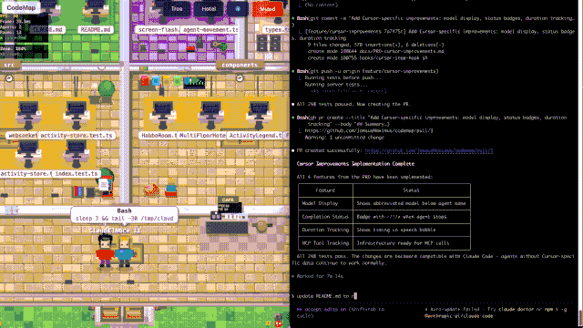

# 🏢 CodeMap Coworking

**Watch your AI coding agents come to life!** See Claude Code and Windsurf as pixel-art characters moving through a coworking space, working at desks, reading files, and writing code in real-time.



## ⚡ One Command Setup

Paste this into Claude Code or Windsurf in any project:

```bash
npx github:sonoragazzi/codemap
```

That's it! The coworking space opens automatically and your agent appears. ✨

---

## ✨ Features

| Feature | Description |
|---------|-------------|
| 🎮 **Live Visualization** | Watch agents move between rooms as they work on your code |
| 🏢 **Smart Layout** | Folders become rooms, files become desks, arranged by git activity |
| 👥 **Multi-Agent** | See up to 10 agents working simultaneously |
| 💬 **Speech Bubbles** | See what tool and file each agent is working on |
| 🦘 **Stuck Detection** | Agents bounce when waiting for input — never waste time on a stuck agent |
| 🎨 **Themed Rooms** | Components (blue), Server (green), Tests (peach), and more |
| ⚡ **Real-time Updates** | Instant feedback as agents read, write, and think |
| 🔄 **Dynamic Refresh** | Coworking reorganizes on each git commit |

### 🤖 Works With

- ✅ **Claude Code** — Full support, automatic hook configuration
- ✅ **Windsurf** — Enhanced features: model name, completion badges, operation timing

---

## 🎯 What You'll See

- 💻 **Computer screens** light up when files are accessed
- 🟡 **Yellow glow** = reading a file
- 🟢 **Green glow** = writing code
- 💭 **Thinking indicator** when agent is processing
- 🚶 **Walking animations** as agents move between rooms
- 🦘 **Bouncing** when agent needs your input or permission
- ☕ **Break room** where idle agents hang out

---

## 🛠 Alternative Setup

### Clone and Run Locally

```bash
git clone https://github.com/sonoragazzi/codemap
cd codemap
npm install
npm run dev
```

Then open http://localhost:5173/coworking

### Setup Hooks Only (no server start)

```bash
npx github:sonoragazzi/codemap setup
```

---

## 📖 How It Works

```
🤖 AI Agent       →  📡 Hooks      →  🖥 Server      →  🎨 Browser
(Claude/Windsurf)    (capture)       (broadcast)       (render)
```

1. Your AI agent reads/writes files or runs commands
2. Hook scripts capture these events
3. Server tracks activity and broadcasts via WebSocket
4. Browser renders the pixel-art coworking space in real-time

---

## 🔧 Technical Details

<details>
<summary>Server API (Port 5174)</summary>

- `POST /api/activity` — File read/write events
- `POST /api/thinking` — Agent thinking state
- `GET /api/graph` — File tree data
- `GET /api/hot-folders` — Git-ranked folders
- WebSocket at `/ws` for real-time updates

</details>

<details>
<summary>Client Routes (Port 5173)</summary>

- `/coworking` — Pixel-art coworking visualization
- `/` — Force-directed graph view

</details>

<details>
<summary>Hook Scripts</summary>

- `file-activity-hook.sh` — Captures file operations
- `thinking-hook.sh` — Captures agent state, model, duration
- `windsurf-stop-hook.sh` — Captures Windsurf completion status
- `git-post-commit.sh` — Triggers layout refresh

</details>

<details>
<summary>Troubleshooting</summary>

**Server not starting?**
```bash
lsof -i :5174  # Check if port in use
curl http://localhost:5174/api/health
```

**Hooks not firing?**
```bash
tail -f /tmp/codemap-hook.log
```

**No agents appearing?**
```bash
curl http://localhost:5174/api/thinking | jq
```

</details>

<details>
<summary>Development</summary>

```bash
npm install
npm run dev           # Start server + client
npm test --workspaces # Run all 248 tests
```

</details>

---

## 📄 License

MIT — Built with ❤️ for the AI coding community
